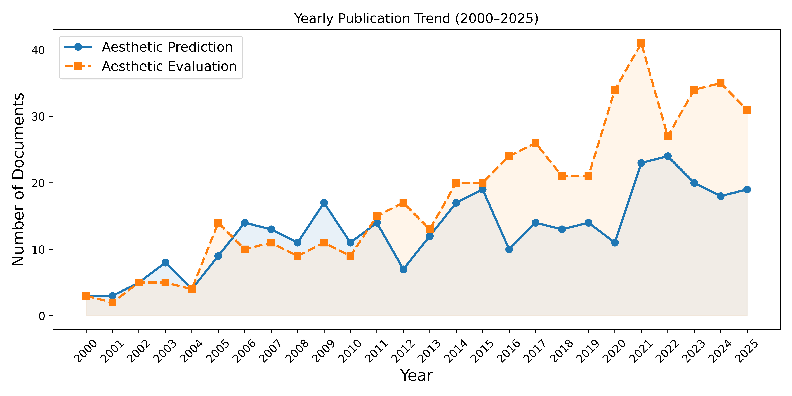

# Automatic Prediction and Evaluation of Aesthetic Outcomes in Plastic and Oncological Surgery  
## A Systematic Review on Current Progress, Challenges, and Future Directions (PRISMA Repository)

**Authors:** Helena Montenegro*†, Mohammad Hossein Zolfagharnasab†, Fábio Teixeira‡, Gonçalo da Costa Sequeira Pinto‡, Joana Santos‡, Pedro Ferreira‡, Eduard-Alexandru Bonci, Carlos Mavioso, Maria J. Cardoso, Jaime S. Cardoso  
**Affiliations:**  
1) INESC TEC, Faculdade de Engenharia, Universidade do Porto, Porto, Portugal  
2) Fundação Champalimaud, Lisboa, Portugal  
3) Faculdade de Medicina, Universidade de Lisboa, Lisboa, Portugal  
**Corresponding author:** `maria.h.sampaio@inesctec.pt`  
†‡ Equal contribution

---

## 1. What This Repository Contains

This repository is the **full PRISMA audit trail** for the systematic review:

> **Automatic Prediction and Evaluation of Aesthetic Outcomes in Plastic and Oncological Surgery: A Systematic Review On Current Progress, Challenges, and Future Directions**

It is designed to make the review **transparent, reproducible, and verifiable**, by providing:

- The **complete PRISMA screening pipeline**  
  *(raw retrieval → duplicate removal → title screening → abstract screening → full-text screening → qualitative screening → final included studies)*
- A **file-level record** of every inclusion/exclusion decision *(CSV logs at each stage)*
- The statistical and qualitative artifacts used in the manuscript *(figures + synthesized summaries)*

The repository aligns with the manuscript’s goals:
- Review SoTA methods for **aesthetic outcome prediction** and **evaluation**
- Organize datasets/benchmarks/models used in the field
- Identify cross-domain overlaps *(facial/breast/oncological/other body regions)*
- Highlight limitations *(data access, heterogeneity, validation gaps)*
- Discuss clinical integration barriers and future directions *(e.g., multimodal models)*

---

## 2. PRISMA Overview (Audit Trail Entry Point)

This review follows the PRISMA framework:
- **Identification**
- **Screening**
- **Eligibility**
- **Inclusion**

The diagram below summarizes **every numerical transition** and **where exclusions occurred**. Each number is backed by a CSV file under `prisma/` (see “Reproducibility” section).

---

## 3. Search Strategy (How Studies Were Found)

### Data Sources
- Scopus  
- PubMed  
- IEEE Xplore  
- Semantic Scholar  
- Manual backward reference search *(bibliographies of included works)*

### Two Complementary Search Tracks
To reflect the dual challenge emphasized in the paper—**pre-operative expectation management** (prediction) and **post-operative standardized assessment** (evaluation)—we conducted two focused searches:

1) **Prediction of aesthetic outcomes** *(simulation / post-op prediction / outcome prediction)*  
2) **Evaluation of aesthetic outcomes** *(assessment / scoring / objective evaluation)*

Exact queries are reported verbatim in the manuscript to ensure full reproducibility.

---

## 4. What the High-Level Statistics Say (Before You Dive into CSVs)

### 4.1 Temporal trend of the field (Prediction vs. Evaluation)

The figure below shows the yearly publication trend. It explains *why* the review splits the taxonomy into prediction and evaluation: evaluation is historically dominant, while prediction accelerates later (especially with modern AI).

**Interpretation (repository-level):**
- **Evaluation** appears earlier and grows steadily *(often lower computational barriers; includes rule-based/objective measurements and classical ML)*.
- **Prediction** shows notable growth in later years, consistent with advances in deep learning, generative modeling, and 3D processing pipelines.

---

### 4.2 Where the articles came from (database contribution)

This figure summarizes how much each source contributed to the candidate pool.

**Interpretation (repository-level):**
- Scopus contributes the largest share of records *(broad indexing)*.
- Semantic Scholar provides strong complementary coverage.
- Manual search captures relevant works that might be missed by strict indexing/query boundaries.

---

### 4.3 Interdisciplinary footprint (prediction vs evaluation domains)

This distribution supports a key claim in the manuscript: the area is inherently interdisciplinary, spanning engineering/computer science and clinical domains.

**Interpretation (repository-level):**
- Both prediction and evaluation heavily intersect with **engineering and computer science**, matching the review’s technical focus.
- A significant fraction lies in **medicine/biochemistry/materials**, reflecting clinical relevance and validation needs.

---

## 5. PRISMA Flow Numbers (Backed by Files)

| Stage | Records |
|------|--------:|
| Identified | 1,027 |
| After duplicate removal | 939 |
| After title screening | 744 |
| After abstract screening | 386 |
| Full-text assessed | 250 |
| After qualitative screening | 182 |
| Final included | 182 (102 main + 85 supplementary) |

All transitions are reproducible using the stage outputs in `prisma/`.

---

## 6. PRISMA Screening Stages (What Each Folder Represents)

This section explains **what happened at each stage**, **where it is stored**, and **how it connects to the paper figures and conclusions**.

---

### 6.1 Stage 01 — Identification (`prisma/01_articles_per_source/`)

**Goal:** Build the *unfiltered* corpus from database search + manual retrieval.

**Core file**
- `articles.csv` — raw retrieved records *(title, abstract, DOI when available, year, venue, source)*

**Why it matters**
- This file is the starting point for all subsequent filtering, synthesis, and statistics.
- The overall growth and temporal behavior of this initial corpus is summarized by:

---

### 6.2 Stage 02 — Duplicate Removal (`prisma/02_duplicate_removal/`)

**Goal:** Remove duplicate studies to prevent double counting and bias in synthesis.

**Files**
- `articles_duplicate_marked.csv` — duplicates flagged  
- `articles_rejected_by_duplicacy.csv` — removed duplicates  
- `articles_after_duplicates.csv` — retained unique records  
- `articles_categorized.csv` — intermediate organization/categorization artifact *(if used)*

**Method (documented)**
- DOI matching *(when available)*
- Normalized title similarity *(fallback when DOI missing)*

**Connection to figures**
- After cleaning, source contributions become interpretable as *unique record coverage*:

---

### 6.3 Stage 03 — Title Screening (`prisma/03_title_screening/`)

**Goal:** Quickly remove clearly out-of-scope records while keeping uncertain ones for abstract review.

**Files**
- `articles_titles_screened_marked.csv` — decision flag per record  
- `articles_rejected_by_titles.csv` — excluded at title stage  
- `articles_after_title_screening.csv` — retained records  

**Operational scope rule (applied consistently)**  
**Include** if the title indicates relevance to at least one of:
- plastic / reconstructive / oncological surgery context
- aesthetic outcome *(appearance, attractiveness, cosmetic result, symmetry, etc.)*
- technical method *(ML/AI, simulation, modeling, measurement, scoring)*

**Exclude** if clearly about:
- non-surgical aesthetic interventions *(e.g., fillers)*  
- unrelated clinical endpoints *(no aesthetic/appearance outcome focus)*  
- non-technical domains outside review scope  

---

### 6.4 Stage 04 — Abstract Screening (`prisma/04_abstract_screening/`)

**Goal:** Enforce methodological relevance and filter by the review’s core tasks:
- **Prediction** *(pre-op / post-op simulation, retrieval-based, generative, 3D modeling)*
- **Evaluation** *(objective metrics, ML/DL scoring, automated assessment)*

**Files**
- `articles_abstract_screened_marked.csv`  
- `articles_rejected_by_abstract.csv`  
- `articles_after_abstract_screening.csv`

**Core inclusion logic (operationalized)**
- Must target prediction or evaluation of aesthetic outcomes  
- Must use imaging *(2D or 3D)*; exclude purely tabular/text-only approaches  
- Exclude works that are primarily medical narrative without technical novelty or evaluation  

**Connection to figures**
- Abstract screening is where the prediction/evaluation split becomes visible and stable:

---

### 6.5 Stage 05 — Full-Text Screening (`prisma/05_fulltext_screening/`)

**Goal:** Confirm eligibility using full-text evidence.

**Files**
- `articles_full-text_screened_marked.csv`  
- `articles_rejected_by_full-text.csv`  
- `articles_after_full-text_screening.csv`

**Full-text eligibility checks include**
- Clear technical contribution beyond descriptive reporting  
- Adequate evaluation design *(metrics, baselines, or validation protocol)*  
- Alignment with imaging-based prediction/evaluation  
- Relevance to surgical aesthetic outcomes *(PR/oncological contexts)*  

**Connection to figures (keyword structure)**
- Co-occurrence summarizes the *topic structure of what remains after eligibility filtering*:

**How to read this figure (practical interpretation)**
- Dense central region → shared concepts across subdomains *(AI/ML, evaluation, clinical practice)*
- Clusters → subtopics *(facial/rhinoplasty, breast reconstruction/BCCT, simulation/generative, etc.)*
- Links → overlap opportunities and transferability across domains discussed in the manuscript

---

### 6.6 Stage 06 — Qualitative / Quality Screening (`prisma/06_qualitive_fulltext_qualitive/`)

**Goal:** Filter eligible papers using a structured, domain-specific quality assessment focused on interpretability for synthesis.

**Files**
- `articles_qualitive_screened_marked.csv`  
- `articles_rejected_by_quality.csv`  
- `articles_after_qualitive_screening.csv`

**Quality dimensions (applied consistently)**
- Novelty *(beyond incremental reporting)*
- Technical rigor *(method clarity, reproducibility, robustness)*
- Dataset adequacy *(size, representativeness, availability)*
- Evaluation validity *(sound metrics, clinical relevance, validation protocol)*
- Practical relevance to aesthetic outcome prediction/evaluation

**Connection to figures (dominant concepts)**
- The dominant terminology after quality screening:

**Interpretation (repository-level)**
- Confirms the final corpus centers on imaging, learning-based methods, and surgical aesthetic outcomes
- Serves as a sanity check that screening preserved the review’s intended scope

---

### 6.7 Stage 07 — Final Included Studies (`prisma/07_candidate_papers/`)

**Goal:** Provide the final list used in synthesis, tables, and discussion.

**File**
- `candidate_papers.csv`

This is the “included studies” list backing:
- method taxonomy
- dataset/benchmark analysis
- cross-domain comparisons
- limitations + future directions

---

### 6.8 Stage 08 — Evidence Synthesis (`prisma/08_summarized_texts/`)

**Goal:** Provide structured summaries used for comparison and narrative synthesis.

**Files**
- `combined_summs.xlsx` — master synthesis sheet  
- `summerized_per_tasks/` — task-wise synthesis:
  - `Prediction.csv`
  - `Evaluation.csv`
  - `Datasets.csv`
  - `Reviews.csv`
  - `Subjective Evaluation.csv`
  - `Support Tasks.csv`

These enable transparent mapping from included studies to:
- claims in the discussion
- reported limitations *(e.g., private datasets)*
- comparative tables and subgroup analyses

---

## 7. Reproducibility and Auditability (How to Verify Everything)

A third party can reproduce the PRISMA trajectory by following the folder order:

1. Start with `prisma/01_articles_per_source/articles.csv`
2. Apply duplicate removal → compare with `prisma/02_duplicate_removal/`
3. Apply title screening → compare with `prisma/03_title_screening/`
4. Apply abstract screening → compare with `prisma/04_abstract_screening/`
5. Apply full-text screening → compare with `prisma/05_fulltext_screening/`
6. Apply qualitative screening → compare with `prisma/06_qualitive_fulltext_qualitive/`
7. Confirm final included list → `prisma/07_candidate_papers/candidate_papers.csv`

Each “rejected” CSV provides an explicit audit trail of exclusions.

---

## 8. Protocol Registration Statement

This review was **not registered in PROSPERO** due to its strong emphasis on **computer science, engineering, and imaging-based computational methodologies**, which extends beyond PROSPERO’s primary biomedical scope.

Protocol transparency is ensured through:
- public release of the full screening trail
- immutable CSV decision logs
- explicit rejection sets at each stage

---

## 9. Repository Hierarchy (Full File Tree)

    review-paper tree
    ├── README.md
    ├── figs
    │   ├── co-occurance_graph.png
    │   ├── distribution_per_category.png
    │   ├── distribution_per_source.png
    │   ├── prisma.jpg
    │   ├── trend_by_year.png
    │   └── word_cloud.png
    └── prisma
        ├── 01_articles_per_source
        │   └── articles.csv
        ├── 02_duplicate_removal
        │   ├── articles_after_duplicates.csv
        │   ├── articles_categorized.csv
        │   ├── articles_duplicate_marked.csv
        │   └── articles_rejected_by_duplicacy.csv
        ├── 03_title_screening
        │   ├── articles_after_title_screening.csv
        │   ├── articles_rejected_by_titles.csv
        │   └── articles_titles_screened_marked.csv
        ├── 04_abstract_screening
        │   ├── articles_abstract_screened_marked.csv
        │   ├── articles_after_abstract_screening.csv
        │   └── articles_rejected_by_abstract.csv
        ├── 05_fulltext_screening
        │   ├── articles_after_full-text_screening.csv
        │   ├── articles_full-text_screened_marked.csv
        │   └── articles_rejected_by_full-text.csv
        ├── 06_qualitive_fulltext_qualitive
        │   ├── articles_after_qualitive_screening.csv
        │   ├── articles_qualitive_screened_marked.csv
        │   └── articles_rejected_by_quality.csv
        ├── 07_candidate_papers
        │   └── candidate_papers.csv
        └── 08_summarized_texts
            ├── combined_summs.xlsx
            └── summerized_per_tasks
                ├── Datasets.csv
                ├── Evaluation.csv
                ├── Prediction.csv
                ├── Reviews.csv
                ├── Subjective Evaluation.csv
                └── Support Tasks.csv
