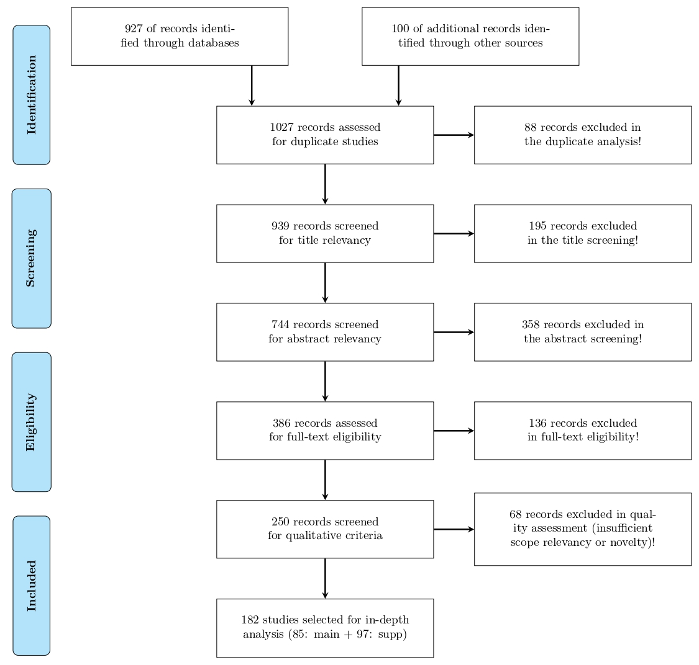
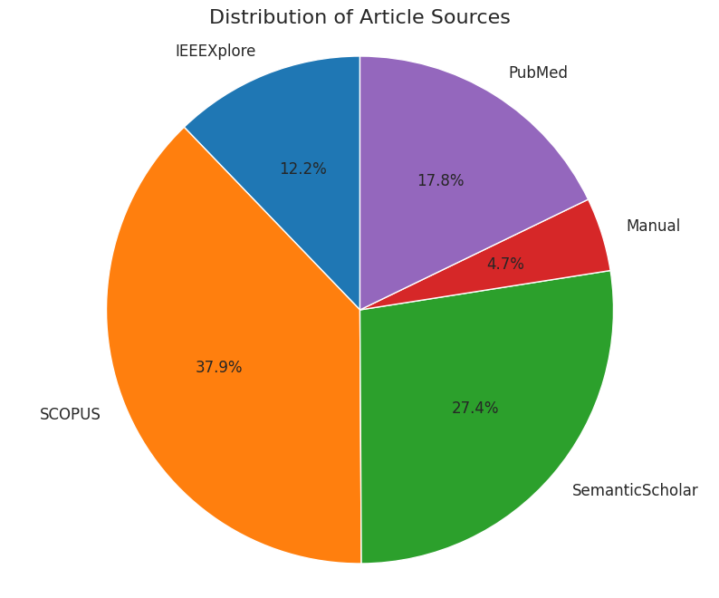
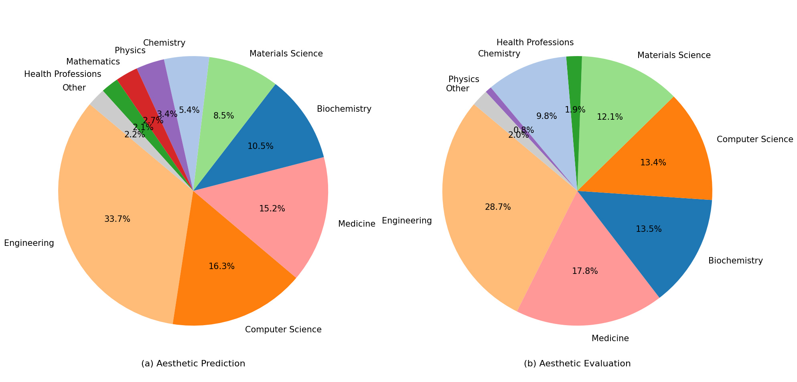
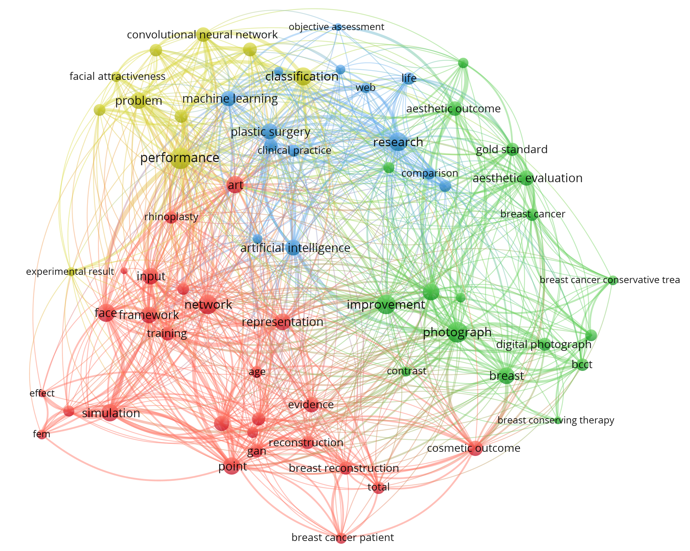
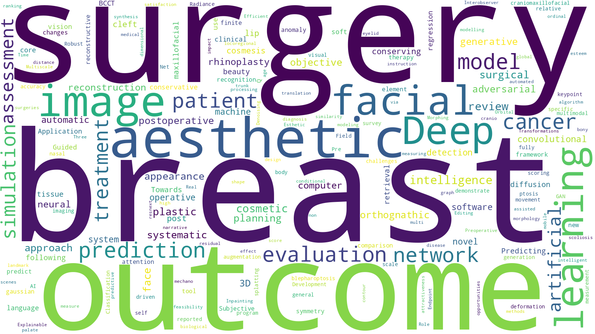

# Automatic Prediction and Evaluation of Aesthetic Outcomes in Plastic and Oncological Surgery: A Systematic Review

**Authors:** Helena Montenegro*†, Mohammad Hossein Zolfagharnasab†, Fábio Teixeira‡, Gonçalo da Costa Sequeira Pinto‡, Joana Santos‡, Pedro Ferreira‡, Eduard-Alexandru Bonci, Carlos Mavioso, Maria J. Cardoso, Jaime S. Cardoso  
**Corresponding author:** `maria.h.sampaio@inesctec.pt`  
†‡ Equal contribution

---

## 1. What This Repository Contains

This repository is the **complete PRISMA audit trail** for the systematic review:

> **Automatic Prediction and Evaluation of Aesthetic Outcomes in Plastic and Oncological Surgery: A Systematic Review on Current Progress, Challenges, and Future Directions**

Its purpose is to make the review **transparent, reproducible, and verifiable** by exposing:

- The **entire PRISMA screening pipeline**, from raw retrieval to final inclusion  
- A **file-level log** of every inclusion/exclusion decision (CSV-based, stage-specific)  
- The **figures used in the manuscript**, directly grounded in the screened datasets  
- Structured summaries that support the paper’s taxonomy, comparisons, and conclusions  

The repository directly supports the paper’s objectives:
- Systematically reviewing **prediction** and **evaluation** methods for aesthetic outcomes  
- Organizing datasets, benchmarks, and computational models  
- Identifying cross-domain overlaps (facial, breast, oncological, other regions)  
- Highlighting limitations in data availability, validation, and reproducibility  
- Supporting future directions toward clinically usable, AI-driven decision-support tools  

---

## 2. PRISMA Workflow and High-Level Evidence

This review follows the PRISMA framework:
**Identification → Screening → Eligibility → Inclusion**

The diagram below is the **structural backbone** of the repository. Every number shown corresponds to an explicit CSV output in `prisma/`, making the diagram fully auditable.

### PRISMA flow numbers (fully backed by files)

| Stage | Records |
|---|---:|
| Identified | 1,027 |
| After duplicate removal | 939 |
| After title screening | 744 |
| After abstract screening | 386 |
| Full-text assessed | 250 |
| After qualitative screening | 182 |
| Final included | 182 (102 main + 85 supplementary) |

---

## 3. Search Strategy (Identification Stage)

### Data sources
- Scopus  
- PubMed  
- IEEE Xplore  
- Semantic Scholar  
- Manual backward reference search (bibliographies of included works)

### Two complementary search tracks
The literature was retrieved using two aligned but independent query strategies:

1. **Prediction of aesthetic outcomes**  
   (pre-operative simulation, post-operative prediction, outcome prediction)
2. **Evaluation of aesthetic outcomes**  
   (assessment, scoring, objective and learning-based evaluation)

Exact queries and filters are reported verbatim in the manuscript to ensure reproducibility.

All raw retrieved records are stored in:
- `prisma/01_articles_per_source/articles.csv`

This stage prioritizes **recall** over precision: duplicates, off-topic records, and heterogeneous metadata are expected.

---

## 4. Identification + Duplicate Removal: What the Data Looks Like Initially

After retrieval, duplicate removal is applied to prevent double counting across databases.

**Duplicate detection strategy**
- DOI matching (primary)
- Normalized title similarity (fallback)

Relevant files:
- `articles_duplicate_marked.csv`
- `articles_rejected_by_duplicacy.csv`
- `articles_after_duplicates.csv`

The **source distribution figure** below becomes meaningful only *after* duplicates are removed, as it reflects unique record contributions rather than indexing artifacts.

**Interpretation**
- Scopus provides the largest share of unique records due to broad indexing  
- Semantic Scholar contributes complementary coverage  
- Manual search captures relevant studies missed by strict database queries  

---

## 5. Screening Stages and Emergence of the Review Taxonomy

### Title Screening → Abstract Screening

These stages progressively enforce **scope** and **methodological relevance**.

#### Title screening (`prisma/03_title_screening/`)
Removes clearly out-of-scope works while remaining conservative.

Inclusion signals:
- Surgical context (plastic, reconstructive, oncological)
- Explicit aesthetic outcome focus
- Technical framing (ML, AI, simulation, modeling, scoring)

#### Abstract screening (`prisma/04_abstract_screening/`)
This is where the **core taxonomy stabilizes**.

Inclusion requires:
- Prediction or evaluation of aesthetic outcomes  
- Imaging-based methods (2D or 3D)  
- Clear computational contribution (not purely narrative or clinical)

The disciplinary distribution below reflects the corpus *after* abstract screening, when prediction vs. evaluation becomes clearly separable.

**Interpretation**
- Both tasks are dominated by engineering and computer science  
- Evaluation shows stronger medical-domain presence, reflecting clinical validation needs  
- This distribution explains why prediction and evaluation differ in datasets, metrics, and maturity  

---

## 6. Full-Text Screening and Conceptual Structure of the Field

### Full-text screening (`prisma/05_fulltext_screening/`)

At this stage, abstracts are no longer sufficient. Full texts are assessed for:
- Technical novelty beyond descriptive reporting  
- Adequate evaluation protocols and metrics  
- Alignment with imaging-based prediction/evaluation  
- Relevance to surgical aesthetic outcomes  

Rejected studies at this stage often:
- Lack evaluable metrics
- Focus primarily on medical discussion without computational contribution
- Do not support comparative synthesis

The **keyword co-occurrence graph** below summarizes the *conceptual structure* of the literature that survives full-text eligibility.

**How to interpret this graph**
- Node size ≈ prominence of a concept in the retained corpus  
- Edges ≈ frequent co-occurrence of concepts  
- Clusters ≈ subdomains (e.g., facial aesthetics, breast reconstruction, learning-based evaluation)

**Why it matters**
- Confirms AI/ML as the central methodological backbone  
- Reveals cross-domain overlap, supporting transferability arguments in the paper  
- Highlights methodological convergence despite surgical heterogeneity  

---

## 7. Qualitative Screening and Final Corpus Validation

### Qualitative / quality screening (`prisma/06_qualitive_fulltext_qualitive/`)

This stage filters eligible papers using **domain-specific quality criteria**:

- Novelty (not purely incremental)
- Technical rigor and clarity
- Dataset adequacy and transparency
- Evaluation validity and clinical relevance
- Practical value for prediction/evaluation workflows

The **word cloud** below summarizes the dominant vocabulary of the *final included corpus*.

**Interpretation**
- Confirms sustained focus on imaging, learning-based models, assessment, and prediction  
- Acts as a scope sanity check: exclusions did not drift the review away from its intended focus  

---

## 8. Final Included Studies and Evidence Synthesis

### Final included studies (`prisma/07_candidate_papers/`)
- `candidate_papers.csv` is the definitive list backing:
  - Method taxonomy
  - Dataset and benchmark analysis
  - Cross-domain comparisons
  - Limitations and future research directions

### Evidence synthesis (`prisma/08_summarized_texts/`)
Structured summaries supporting the manuscript:
- `combined_summs.xlsx` — unified synthesis  
- Task-wise summaries:
  - `Prediction.csv`
  - `Evaluation.csv`
  - `Datasets.csv`
  - `Reviews.csv`
  - `Subjective Evaluation.csv`
  - `Support Tasks.csv`

These files directly support tables, figures, and comparative discussions in the paper.

---

## 9. Reproducibility and Auditability

The PRISMA trajectory can be reproduced by following the numbered folders:

1. `01_articles_per_source`
2. `02_duplicate_removal`
3. `03_title_screening`
4. `04_abstract_screening`
5. `05_fulltext_screening`
6. `06_qualitive_fulltext_qualitive`
7. `07_candidate_papers`

Each stage includes both **retained** and **rejected** records with explicit reasons.

---

## 10. Protocol Registration Statement

This review was **not registered in PROSPERO** due to its strong emphasis on **computer science, engineering, and imaging-based computational methods**, which extend beyond PROSPERO’s primary biomedical scope.

Protocol transparency is instead ensured through:
- Public release of the full PRISMA audit trail  
- Immutable CSV decision logs  
- Stage-specific rejection files  

---

## 11. Repository Hierarchy

    review-paper tree
    ├── README.md
    ├── figs
    │   ├── prisma.jpg
    │   ├── trend_by_year.png
    │   ├── distribution_per_source.png
    │   ├── distribution_per_category.png
    │   ├── co-occurance_graph.png
    │   └── word_cloud.png
    └── prisma
        ├── 01_articles_per_source
        ├── 02_duplicate_removal
        ├── 03_title_screening
        ├── 04_abstract_screening
        ├── 05_fulltext_screening
        ├── 06_qualitive_fulltext_qualitive
        ├── 07_candidate_papers
        └── 08_summarized_texts
